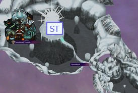
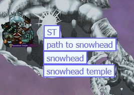

# Majora's Mask Randomizer Tracker Modifier

Majora's Mask Randomizer Tracker Modifier (MMRTM) is a static website for modifying the HTML tracker outputted by [MMR](https://github.com/ZoeyZolotova/mm-rando). This tool can be run locally on your machine. A hosted version is in the works.

The main goal of this project was to make a couple of changes I wanted to see be implemented into a freshly baked randomizer's tracker as soon as possible. No extra copies of the tracker. No Node.js. No Electron apps. This does everything in browser with pure JavaScript.

**If you have questions about a specific add-on, please see [addons.md](docs/addons.md).**

## Table of Contents

- [Credits](#credits)
- [Compatibility](#compatibility)
- [Setup](#setup)
- [Features](#features)
  - [Add-on's and Add-on Accessories](#add-ons-and-add-on-accessories)
  - [Tracker Memory](#tracker-memory)
  - [Add-on Selector](#add-on-selector)
  - [Settings Editor](#settings-editor)
  - [Query Parameters](#query-parameters)
- [Built-in Add-on's](#built-in-add-ons)
  - [Tracker](#tracker)
  - [Shared Modifier](#shared-modifier)
  - [Shortcut Manager](#shortcut-manager)
  - [Annotator](#annotator)
  - [Auto Dark Highlight](#auto-dark-highlight)
  - [Check Filterer](#check-filterer)
  - [Map Navigator](#map-navigator)
  - [Marked Log Generator](#marked-log-generator)
  - [Show Collected](#show-collected)
  - [State Saver](#state-saver)
  - [Text Search](#text-search)
- [How It Works](#how-it-works)
- [Want To Write Your Own?](#want-to-write-your-own)

## Credits

**Thank you to VGCartography for letting me use the Majora's Mask map included in this project. The original file can be found [here](https://www.deviantart.com/vgcartography/art/Zelda-Majora-s-Mask-Termina-World-Map-948944731). Socials: [Bluesky](https://bsky.app/profile/vgcartography.bsky.social), [Esty](https://www.etsy.com/shop/VGCartography), [DeviantArt](https://www.deviantart.com/vgcartography), [YouTube](https://youtube.com/@vgcartography)**

**And the Randomizer community for existing. This was fun to make.**

## Compatibility

Versions or forks not listed in the below sections may also be compatible with this tool, but these are the only ones I've verified.

#### Browsers

- Firefox 138+
- Edge 136+
- Chrome 136+

#### Randomizers

- [MMR](https://github.com/ZoeyZolotova/mm-rando)
  - `v1.15.2.1` - `v1.16.0.12`
- [Actorizer](https://github.com/isghj5/mm-rando)
  - `Test version 88.3`

## Setup

MMRTM requires no more setup than unzipping a release download and making the changes you want to see in the tracker.

1. Download the [lastest release](https://github.com/frogssoldseparately/mmrtm/releases/latest)
2. Unzip to your desired location

**Note: MMRTM makes use of LocalStorage, and some of the convenience comes from this persistency. Take care to not move the files after you begin using it, as the saved data is tied directly to the location of the folder in your system. If the folder is moved, any saved settings or tracker progress will not move with it to the new location.**

3. In the unzipped folder, open `MMRTM.html` in your browser of choice
4. Follow further directions on the page

This tool does not make changes to the original tracker file. These changes only exist in browser while the modifier is active.

## Features

#### Add-on's and Add-on Accessories

MMRTM comes with 8 enchancement add-on's that facilitate better navigation, autosaving, styling options, and more. They are customizable, togglable, and ready to go out of the box. There are more planned, but [these](#built-in-add-ons) are what's available for now.

#### Tracker Memory

If LocalStorage is enabled, the modifier will remember the most recent tracker used. This eliminates the need to nagivate file explorers for the tracker each time the modifier is run.

#### Add-on Selector

A list of all available add-on's is immediately presented in the modifier. The left column is add-on's that are not active, and the right column is add-on's that are active. To make an add-on active or inactive, click the element in the respective list and press `ENTER`.

If LocalStorage is enabled, what add-on's are active will persist between sessions.

#### Settings Editor

For add-on's that have customizable settings, a settings tab will appear when they are made active. All settings are presented in json, and formatting errors will be alerted to the user upon saving, marking both what settings tab the error arises from as well as the line.

`CTRL + S` (or use the save button) to save changes to all settings

`CTRL + ENTER` (while the settings editor is active) to switch to the next tab

`CTRL + SHIFT + ENTER` (while the settings editor is active) to switch to the previous tab

#### Query Parameters

There are a couple of query parameters that are accepted that can further enhance experiences with the modifier. These are case sensitive, with all parameters being lowercase.

`?autobuild` will run the modifier before the page is even loaded. This requires LocalStorage to function, as this skips changing active add-on's, settings, and even selecting what tracker is being modified.

Ex: `path/to/the/modifier/MMRTM.html?autobuild`

`?silent` will mute any alerts given off by add-on's that respect muting, such as reminders of what shortcuts exist.

Ex: `path/to/the/modifier/MMRTM.html?silent`

`?load` is a parameter used to only load specific add-on's instead of modifying an entire tracker. This can be useful for making pop-up versions of an add-on, like a map in a separate window that still communicates with the main instance of MMRTM. This should be utilized by an add-on and not the end user directly.

Ex: `127.0.0.1:80/MMRTM.html?load=mapNavigator+sharedModifier`

To get the most utility possible out of this, having a bookmark for both the original file for when you do have to make changes (swap trackers, settings, etc.) - `path/to/the/modifier/MMRTM.html` - and one that is autobuilt and silent for when you are returning to the same tracker - `path/to/the/modifier/MMRTM.html?autobuild&silent` - could be useful. The latter gets you right into randomizer.

## Built-in Add-on's

For more information on any of the add-on's listed below, please see the [add-on's writeup](docs/addons.md).

### Required

#### Tracker

This is the container for the original tracker that you give to MMRTM. For the modifier to actually do anything, this add-on is required.

---

#### Shared Modifier

This is a helper add-on that performs tasks that multiple add-on's require. For the sake of DRY, this just reduces redundant code and does nothing on its own.

---

#### Shortcut Manager

This streamlines setting up and maintaining shortcut bindings between play sessions. Any add-on can make use of this.

Notes:

- This will only save your shortcut preferences between sessions if you have LocalStorage enabled. Otherwise, the default bindings will be used at the start of each session.
- After a tracker is modified and built, you can press `CTRL + B` to open the binding menu to change shortcuts for any add-on that uses them. `CTRL + SHIFT + B` will set shortcut bindings to their default values.
- Valid shortcut bindings are anything that isn't just a lowercase letter.

---

Having only the above add-on's active will run the tracker as it originally came.

### Optional

#### Annotator

This is a notetaking add-on, allowing for easier tracking of known item locations and gossip hints. Each note has a button to jump to the respective entry in the Item Replacements table.

This makes use of autocomplete containing each region, check, item, and item/minigame/misc price used in the current tracker.

Notes:

- Each entry must conform to the template: `[region][check][has/costs][item 1][item 2][...][item N]`
- `[region]` is only required if you are trying to disambiguate between two checks of the same name in two separate regions (like "Clock Town Map Purchase" in North Clock Town and Ikana Canyon).
- Everything that comes before the `[has/costs]` tag doesn't have to be a region or check name, but the entry jump button will only work if it is a valid check. Everything that comes after the `[has/costs]` tag can be whatever is most useful for you, as the actual values are not currently used for anything but display.

The contents of the notes panel will be saved between sessions if LocalStorage is active.

---

#### Auto Dark Highlight

This sets the theme of the tracker, chosen in the settings, on page load. It will also check the "highlight available checks" control.

---

#### Check Filterer

This implements a modified version of [Isghj's Actorizer](https://github.com/isghj5/mm-rando) check filtering system. It allows the Item Replacements table to have rows omitted based on the category of the items they hold.

---

#### Map Navigator

Adds a hideable, static map to more easily navigate the tracker by region.

The regions that appear on the map are controlled in the add-on's settings under `regionOwnership`. An example of valid region json is as follows:

```json
"Woodfall": {
    "locations": [
        "Woodfall",
        "Woodfall Temple"
    ],
    "style": "top: 74%; right: 22%; background-color: green; border: 2px solid #2f2; color: #2f2",
    "label": "WF",
    "title": "Woodfall"
}
```

The name of the property, in this case `Woodfall`, denotes the parent region of all regions listed under `locations` and is the Item Replacements region that will be jumped to when the button is clicked. If instead the property were called `Woodfall Temple`, the Woodfall Temple row is what would be jumped to. If the desired parent region doesn't exist in a tracker, the first region in `locations` that does exist is the parent.

The following properties are purely aesthetic:

- `style` controls how the button appears, both location and theme.
- `label` is the text that appears on the button.
- `title` is the tooltip that appears while hovering over the button.

The aforementioned region ownership exists for two reasons. One is the option to make a map button disappear after all associated checks are collected, and the other is the subregion access feature. If you right click a region button, each region in `locations` will appear as a list of buttons below.




`navButtons` property in the add-on's settings controls additional navigational buttons for scrolling to sections in the Item Locations table. An example of valid navigation button json is as follows:

```json
{
  "id": "go-to-keys-button",
  "classList": "navigation-button navigation-hideable",
  "onclick": "goToId('#dungeonkeys-row')",
  "innerHTML": "Keys"
}
```

- `id` is to ensure the modifier has a unique way to reference the button. This can be whatever you want, but a good template is just `go-to-[innerHTML]-button`.
- `classList` is to control how the button behaves.
  - "navigation-button" indicates it is a button that appears along the top of the map module
  - "navigation-hideable" indicates that when the map is hidden, this button is also hidden
- `onclick` is the function that runs when the button is clicked and should almost always be:

```js
goToId("#[name of the row in all lower case with no spaces]-row");
```

- `innerHTML` controls the displayed text in the button

---

#### Marked Log Generator

This exports a spoiler log with indicators for what checks were collected. The format matches the original spoiler log as closely as possible.

Note: This is only really useful if you, like myself, are a data hoarder and like to archive randomizer runs.

---

#### Show Collected

This re-enables a feature from the [MMR](https://github.com/ZoeyZolotova/mm-rando) tracker that highlights _collected_ checks differently than accessible checks.

---

#### Text Search

When typing anywhere on the page (that isn't the tracker state control), a textbox appears at the top of the page and is used to search the check names in the Item Replacements table. The first best match is automatically focused as you type. `ENTER` and `SHIFT + ENTER` will navigate to the next and previous matches respectively. `ESCAPE` clears the search and brings focus back to the top of the tracker.

AND's in queries (e.g., show results that contain "thisstring" AND "thatstring") utilize the `*` character. It is used to deliminate multiple strings that are _required_ to appear in results.

OR's in queries (e.g., show results that contain "thisstring" OR "thatstring") utilize the `+` character. It is used to deliminate multiple strings that _can_ appear in valid results. Only one string must be contained for a result to be valid.

Currently, only one type of these query characters can be used in a search at a time. Either `+` or `*`, but not both.

**Note: Due to the flexibility of [shortcuts](#shortcut-manager), only lowercase letters, spaces, and two special query characters will be accepted while searching. Uppercase letters and numbers are ignored.**

---

#### Tracker State Saver

This automatically saves your progress for future sessions every time you change the tracker state (un/marking a check). To use this add-on, LocalStorage must be active as there's nothing for it to do otherwise. When a tracker with a different seed is built, the saved state is automatically cleared and a "Copy Last State to Clipboard" button is available (in case the tracker swap was a mistake).

## How It Works

The general flow is:

1. User picks their tracker, with this being stored in plain text for later use.
2. User picks add-on's and changes settings, with this being tracked by controllers.
3. When the user builds the modified tracker, snippets are retrieved, modified, and held by their respective add-on controllers.
4. The page is completely wiped of all contents, and these snippets are injected back into the blank page as functioning HTML, CSS, and JavaScript.
5. The modified tracker is ready.

To have this tool run locally, almost everything that makes up the add-on's are built into [MMRTM.html](MMRTM.html) directly as plain text script tags, so as to avoid fetching resources. The snippets that go into the modified tracker come from these scripts. Controllers for each of the add-on's (found in [addOn.js](js/addOn.js)) take these snippets, sometimes modifying them or other add-on's snippets, to be injected into the page as functional blocks. A parent controller of all add-on's handles wiping the page, injecting add-on snippets in the correct order, and then executing staged JavaScript when appropriate. **Everything is done statically and without routing.**

## Want To Write Your Own?

If you want to write your own add-on's, please see the [additional reading](docs/modifierAnatomy.md) on the subject. I built up a bit of infrastucture to make new additions easier for my future self, and you too can benefit (or suffer) from this decision.
