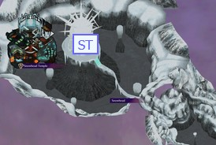
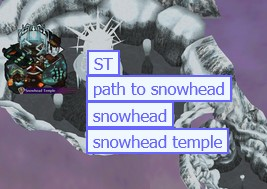

# Add-on's

Shortcut entries that do not have a name are ones that cannot be rebound and are usually tied to a specific element.

## Table of Contents

- [Tracker](#tracker)
- [Shared Modifier](#shared-modifier)
- [Shortcut Manager](#shortcut-manager)
- [Annotator](#annotator)
- [Auto Dark Highlight](#auto-dark-highlight)
- [Check Filterer](#check-filterer)
- [Map Navigator](#map-navigator)
- [Marked Log Generator](#marked-log-generator)
- [Show Collected](#show-collected)
- [State Saver](#state-saver)
- [Text Search](#text-search)

## Tracker

[Class Page](classes/tracker.md)

This add-on acts as a container for the original tracker, storing it as a modifiable DOM tree that can be accessed by other add-on's. This add-on also fixes some text that breaks during the process of turning the raw text into a DOM tree.

### Settings

|       name        |  type   |                                    description                                     |
| :---------------: | :-----: | :--------------------------------------------------------------------------------: |
| showLoadingScreen | boolean | Whether or not to show the MMRTM splash screen while the modified tracker is built |

## Shared Modifier

[Class Page](classes/sharedModifier.md)

This add-on is not useful for the end user to interact with directly. It provides some shared resources for add-on's to access while minimizing conflictions, like making specific changes to the original tracker that multiple add-on's require.

## Shortcut Manager

[Class Page](classes/shortcutManager.md)

This add-on handles shortcut bindings and prevents conflicting bindings.

### Shortcuts

| name |     binding      |                    use                    |
| :--: | :--------------: | :---------------------------------------: |
|      |     CTRL + B     |      Open the shortcut binding menu       |
|      | CTRL + SHIFT + B | Reset shortcut bindings to their defaults |

## Annotator

[Class Page](classes/annotator.md)

This add-on presents as a collapsible panel at the top of the page where notes about item locations can be stored. To use, just type check names, items, or prices into the text box and select the desired item from the autocomplete list. This is done for each "word" (each check/item/price), insteading of typing out the entire note at once. After submitting the note, if it is valid, it will be added to the table below the textbox. The button at the start of each row will take you to the corresponding check.

**Note: It's a little rough in its current state, but does function. I plan on making it more intuitive and easier to use.**

### Shortcuts

|       name       |    binding    |                            use                            |
| :--------------: | :-----------: | :-------------------------------------------------------: |
| annotator:toggle |   SHIFT + N   |            Toggle the note panel's visibility             |
|                  |    ESCAPE     | Deletes badges that have not been pushed to the table yet |
|                  |     ENTER     |           Selects the first autocomplete option           |
|                  | SHIFT + ENTER |    Pushes current badges to the table as a note entry     |
|                  |      TAB      |   Focuses autocomplete control if there are any options   |

### Settings

|        name         |  type   |               description                |
| :-----------------: | :-----: | :--------------------------------------: |
|     panelColor      | string  | CSS background color for the notes panel |
| collapseButtonStyle | string  | CSS string to style the collapse button  |
|    textboxStyle     | string  |  CSS string to style the notes textbox   |
|   enableShortcuts   | boolean |   Whether shortcuts are active or not    |

## Auto Dark Highlight

[Class Page](classes/autoDarkHighlight.md)

This add-on sets the desired theme on start, for those averse to light themes, and highlights available checks automatically.

### Settings

|      name       |  type   |                 description                 |
| :-------------: | :-----: | :-----------------------------------------: |
|  defaultTheme   | string  |          Either "light" or "dark"           |
| highlightChecks | boolean | Whether or not to highlight checks on start |

## Check Filterer

[Class Page](classes/checkFilterer.md)

Provides the option to filter out rows in the Item Replacements table based on their contents after being collected.

## Map Navigator

[Class Page](classes/mapNavigator.md)

Adds a hideable, static map to more easily navigate the tracker by region.

The regions that appear on the map are controlled in the add-on's settings under `regionOwnership`. An example of valid region json is as follows:

```json
"Woodfall": {
    "locations": [
        "Woodfall",
        "Woodfall Temple"
    ],
    "style": "top: 74%; right: 22%; background-color: green; border: 2px solid #2f2; color: #2f2",
    "label": "WF",
    "title": "Woodfall"
}
```

The name of the property, in this case `Woodfall`, denotes the parent region of all regions listed under `locations` and is the Item Replacements region that will be jumped to when the button is clicked. If instead the property were called `Woodfall Temple`, the Woodfall Temple row is what would be jumped to. If the desired parent region doesn't exist in a tracker, the first region in `locations` that does exist is the parent.

The following properties are purely aesthetic:

- `style` controls how the button appears, both location and theme.
- `label` is the text that appears on the button.
- `title` is the tooltip that appears while hovering over the button.

The aforementioned region ownership exists for two reasons. One is the option to make a map button disappear after all associated checks are collected, and the other is the subregion access feature. If you right click a region button, each region in `locations` will appear as a list of buttons below.




`navButtons` property in the add-on's settings controls additional navigational buttons for scrolling to sections in the Item Locations table. An example of valid navigation button json is as follows:

```json
{
  "id": "go-to-keys-button",
  "classList": "navigation-button navigation-hideable",
  "onclick": "goToId('#dungeonkeys-row')",
  "innerHTML": "Keys"
}
```

- `id` is to ensure the modifier has a unique way to reference the button. This can be whatever you want, but a good template is just `go-to-[innerHTML]-button`.
- `classList` is to control how the button behaves.
  - "navigation-button" indicates it is a button that appears along the top of the map module
  - "navigation-hideable" indicates that when the map is hidden, this button is also hidden
- `onclick` is the function that runs when the button is clicked and should almost always be:

```js
goToId("#[name of the row in all lower case with no spaces]-row");
```

- `innerHTML` controls the displayed text in the button

### Shortcuts

|           name            |  binding  |                  use                   |
| :-----------------------: | :-------: | :------------------------------------: |
| mapNavigator:decreaseSize |     ,     | Decrease map size by a discrete amount |
|   mapNavigator:minimize   | SHIFT + < | Set map size to the smallest possible  |
| mapNavigator:increaseSize |     .     | Increase map size by a discrete amount |
|   mapNavigator:maximize   | SHIFT + > |  Set map size to the biggest possible  |
|    mapNavigator:toggle    | SHIFT + M |         Toggle map visibility          |

### Settings

|          name          |   type   |                                                           description                                                            |
| :--------------------: | :------: | :------------------------------------------------------------------------------------------------------------------------------: |
|      mapImagePath      |  string  |                                                 url/relative path for the image                                                  |
|    enableShortcuts     | boolean  |                                               Whether shortcuts are active or not                                                |
|    enablePopupMode     | boolean  | Whether the map is created in a separate window or not. Due to certain limitations, this only works when the modifier is hosted. |
|  hideClearedLocations  | boolean  |                            Whether or not to hide a map button after all related checks are collected                            |
| revertStyleInActorizer | boolean  |                                  Whether or not to remove button styling done by the Actorizer                                   |
|       navButtons       | [object] |                          Information on how to construct the navigation buttons atop the map container                           |
|    regionOwnership     |  object  |                      Information on how to build the map buttons and what regions they are associated with                       |

## Marked Log Generator

[Class Page](classes/markedLogGenerator.md)

This exports a spoiler log with indicators for what checks were collected. The format matches the original spoiler log as closely as possible.

Note: This is only really useful if you, like myself, are a data hoarder and like to archive randomizer runs.

## Show Collected

[Class Page](classes/showCollected.md)

This re-enables a feature from the [MMR](https://github.com/ZoeyZolotova/mm-rando) tracker that highlights _collected_ checks differently than accessible checks. Adds a checkbox to toggle this being active.

### Shortcuts

|         name         |     binding      |                    use                     |
| :------------------: | :--------------: | :----------------------------------------: |
| showCollected:toggle | CTRL + SHIFT + C | Toggles the collected highlighting feature |

### Settings

|      name       |  type   |                    description                     |
| :-------------: | :-----: | :------------------------------------------------: |
| enableShortcuts | boolean |        Whether shortcuts are active or not         |
|  enableOnStart  | boolean | Whether the highlighting is active on start or not |
| lightModeFormat | string  | CSS for how the highlights look in the light theme |
| darkModeFormat  | string  | CSS for how the highlights look in the dark theme  |

## State Saver

[Class Page](classes/stateSaver.md)

This automatically saves your progress for future sessions every time you change the tracker state (un/marking a check). To use this add-on, LocalStorage must be active as there's nothing for it to do otherwise. When a tracker with a different seed is built, the saved state is automatically cleared and a "Copy Last State to Clipboard" button is available (in case the tracker swap was a mistake).

## Text Search

[Class Page](classes/textSearch.md)

When typing anywhere on the page (that isn't the tracker state control), a textbox appears at the top of the page and is used to search the check names in the Item Replacements table. The first best match is automatically focused as you type.

AND's in queries (e.g., show results that contain "thisstring" AND "thatstring") utilize the `*` character. It is used to deliminate multiple strings that are _required_ to appear in results.

OR's in queries (e.g., show results that contain "thisstring" OR "thatstring") utilize the `+` character. It is used to deliminate multiple strings that _can_ appear in valid results. Only one string must be contained for a result to be valid.

Currently, only one type of these query characters can be used in a search at a time. Either `+` or `*`, but not both.

**Note: Due to the flexibility of [shortcuts](#shortcut-manager), only lowercase letters, spaces, and two special query characters will be accepted while searching. Uppercase letters and numbers are ignored.**

### Shortcuts

| name |    binding    |                 use                 |
| :--: | :-----------: | :---------------------------------: |
|      |     ENTER     |          Show next result           |
|      | SHIFT + ENTER |        Show previous result         |
|      |    ESCAPE     | Clear search and go back to the top |

### Settings

|      name       |  type  |                        description                         |
| :-------------: | :----: | :--------------------------------------------------------: |
| idleClearTimeMs | string | How many milliseconds to wait before hiding the search box |
